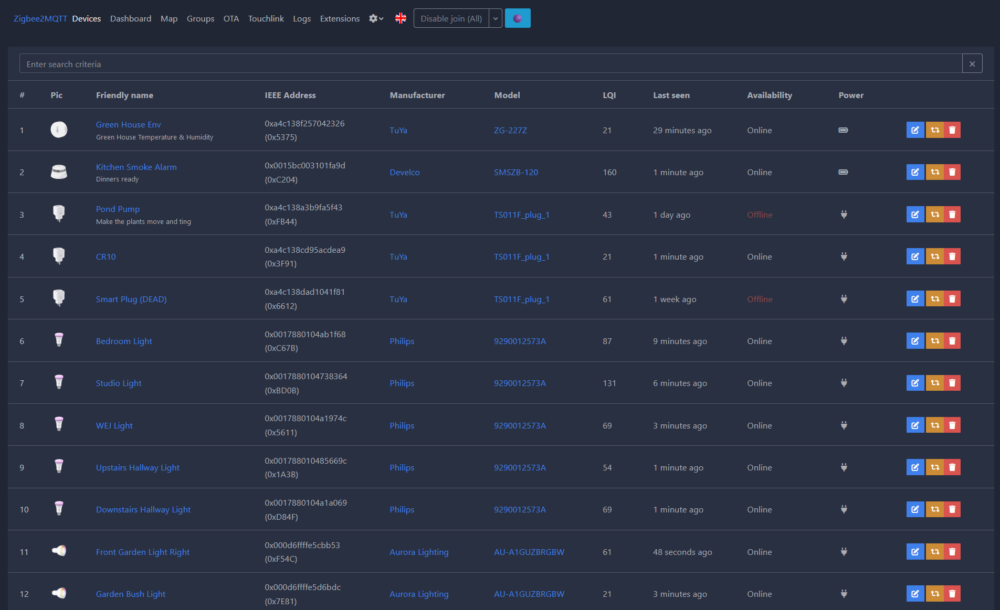
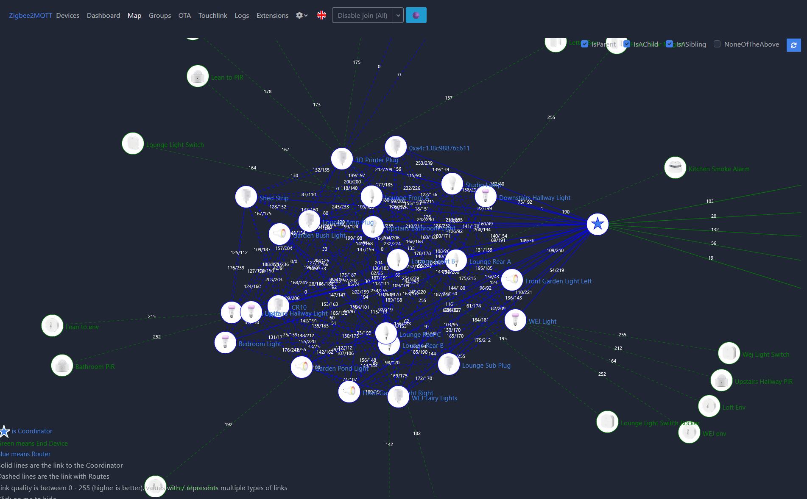

[](https://github.com/nurikk/zigbee2mqtt-frontend/actions/workflows/node.js.yml)
[](https://sonarcloud.io/summary/new_code?id=nurikk_zigbee2mqtt-frontend)
[](https://codebeat.co/projects/github-com-nurikk-zigbee2mqtt-frontend-dev)

# Screenshots




# Translation

You miss a translation? You want to help? You can contribute new languages and improvements via the external website [poeditor.com](https://poeditor.com/join/project?hash=Az88waAhPd).

# Develop

Install dependencies

```bash
pnpm install
````

Develop using mock data

```bash
npm run start
open http://localhost:3030/
````

Develop using your z2m instance

```bash
Z2M_API_URI="ws://192.168.1.200:8080" npm run start
open http://localhost:3030/
```

# Build

```bash
npm install
npm run build //compiled files at ./dist
```

# Sponsors

[JetHome](https://jethome.ru/)


