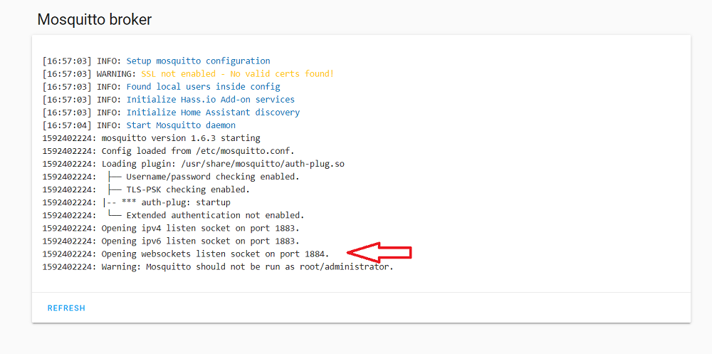

[](https://travis-ci.com/nurikk/z2m-frontend)

# Demo
[Demo](https://nurikk.github.io/z2m-frontend/)


# Build
```bash
npm install
npm run build //compiled files at ./dist
```

# Develop
```bash
npm install
npm run start
open http://localhost:3030/
```

# Screenshots


# Installation and usage
0. Also avaliable as *HACS* intefration. Just add this repo into custom repo list

1. Check Mosquitto Broker logs right after a startup. You should be able to determine a websocket port in this log entry:
```
Opening websockets listen socket on port 1884
```


2. Download the latest [release](https://github.com/nurikk/z2m-frontend/releases) zip archive. Unzip it. Open file `index.html` in the browser.
3. Navigate to the `Settings` tab and fill all the options. Make sure you use **websocket** port from the step 1 in the mqtt server address.
4. Press `Submit` button and then refresh the page.
5. Navigate to the `Home` tab. You should be able to see the list of your devices.
6. Navigate to the `Map` tab and press button `Requests` in order to draw a map of your ZigBee network. After a couple of seconds the map should appear automatically. 
Remember that the map will be erased after refreshing the browsers page.

